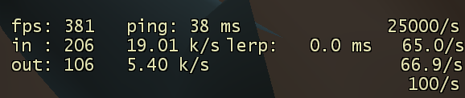

# tf2 0 lerp real

\>completely removes clientside interpolation of entities (closest thing to 0 lerp) 
\>effects of cvar `cl_interp 0` and `cl_interp_ratio 0` that would apply in a `sv_client_min_interp_ratio 0` environment are purely visual in net graph 
\>`cl_updaterate 25000` and `cl_cmdrate 100` are purely visual in net graph
#
Your antivirus will probably flag either of the assets as malicious, this is due to the nature of all code-injecting and memory-manipulating programs. For that reason, disable antivirus and exclude the file.
#
⚠⚠ I am **not** responsible for actions that might be taken against your account if any binaries are run/injected within a secure environment. Use alt-account or launch with `-insecure` to avoid joining VAC-secured servers.   

ㅤ

probably wont be maintaining this for long lmfao

